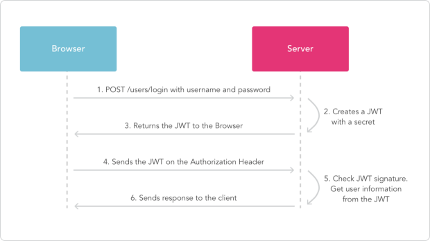

####1.什么是JWT
<p>
JWT全称：Json web token 是为了网络应用环境间传递声明而执行的一种基于JSON的开发标准
</p>

####2.JWT的应用场景
<p>
一般被用来在身份提供者和服务提供者间传递被认证的用户身份信息，以便于从资源服务器获取资源，简而言之它就是从客户端发送给服务端的一种身份认证.
</p>

####3.传统的session
<p>
我们知道，http协议本身是一种无状态的协议，而这就意味着如果用户向我们的应用提供了用户名和密码来进行用户认证，那么下一次请求时，用户还要再一次进行用户认证才行，因为根据http协议，我们并不能知道是哪个用户发送的请求，所以为了让我们的应用能识别是哪个用户发出的，我们只能在服务器存储一份用户登陆的信息，这份登陆信息会在响应时传递给客户端，告诉其保存为cookie，以便下次请求时发送给我们的服务器，这样我们的服务器就能识别请求来自哪个用户了，这就是传统的基于sessino认证
</p>

####4.传统的session认证暴露的问题
<p>
1.Session：每个用户经过我们的应用认证之后，我们的应用都要在服务端做一次记录，以便用户下次请求的鉴别，通常而言session都是保存在内存中，而随着认证用户的增多，服务端的开销会明显增大
</p>

<p>
2.扩展性：用户认证之后，服务端做认证记录，如果认证的记录被保存在内存的话，这意味着用户下次请求还必须要请求在这台服务器上，这样才能拿到授权的资源，这样在分布式的应用上，响应的限制了负载均衡器的能力，也意味着限制了应用的扩展性
</p>

<p>
CSRF：因为是基于cookie来进行用户识别的，cookie如果被截获，用户就会很容易受到跨站请求伪造的攻击
</p>

####5.基于token的鉴权机制
<p>
基于token的鉴权机制类似于http协议也是无状态的，它不需要在服务端去保留用户的认证信息或会话信息。这也就意味着基于tokent认证机制的应用不需要去考虑用户在哪一台服务器登陆了，这就为应用的扩展提供了便利.
</p>

<p>
token的流程
用户使用用户名密码请求服务器
服务器进行验证用户信息
服务器通过验证发送给客户端一个token
客户端存储token，并在每次请求时附加这个token值
服务器验证token，并返回数据
</p>

<p>
这个token必须要在每次请求时发送给服务器，它应该保存在请求头中，另外，服务器要支持CORS（跨来源资源共享）策略，一般我们在服务端这么做就可以了 Access-Control-Allow-Origin：*
</p>

####6.token的应用
<p>
一般是在客户端请求头里加入Authorization，并加上Bearer标注;服务端会验证token，如果验证通过就会返回相应的资源.
</p>
```
 headers: {
    'Authorization': 'Bearer ' + token
  }
```


####7.token的组成部分
<p>
JWT是由三部分构成，将这三段信息文本用“.”链接构成了JWT字符串第一部分我们称它为头部（header）第二部分我们称其为载荷（payload，类似于飞机上承载的物品），第三部分是签证（signature）
</p>

<p>
第一部分：header
JWT的头部承载的两部分信息：
声明类型，这里是jwt
声明加密的算法，通常直接使用HMAC SHA256
完整的头部就像下面这样的JSON
{
     'typ':'JWT',
     'alg':'HS256'  
}
</p>

<p>
第二部分plyload
载荷就是存放有效信息的地方。这个名字像是特指飞机上承载的货品，这些有效信息包含三个部分
标准中注册的声明、公共的声明、私有的声明;如下定义一个payload,然后将其base64加密，得到
jwt的一部分
</p>

```
{
  "sub": "1234567890",
  "name": "John Doe",
  "admin": true
}   
```

<p>
第三部分Signature
jwt的第三部分是一个签证信息，这个签证信息由三部分组成：
header(base64后的)
payload(base64后的)
secred     
这个部分需要base64加密后的header和base64加密后的payload使用“.”连接组成的字符串，然后通过header中声明的加密方式进行加secret组合加密，然后就构成了jwt的第三部分
</p>
<p>
1.前端通过用户名和密码进行登录，
2.后台根据相应的参数通过getToken获取token并存入数据库且返回到前端
3.前端将从后台获得的token存储于cookie中，每次前端发送请求时，请求头中要加入token，
4.后台拦截前端的请求并将token解析出来存入jwt中【registerToken】
5.在Basectrl中通过_checkRole确定是否登录
</p>
