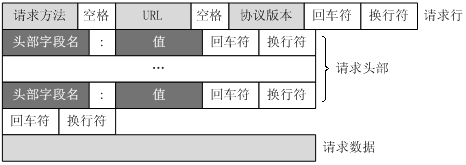

####Http 超文本传输协议

Http工作于客户端服务器架构上，浏览器作为客户端通过URL向服务器即web服务器发送请求，web服务器根据接收到的请求向客户端发送响应信息。

#####Http 的特点

1.无连接：无连接的含义是限制每次连接只处理一个请求，服务器处理完客户端的请求，并收到客户端的应答后即断开连接

2.无状态：Http协议是无状态协议，无状态是指协议对于事物的处理没有记忆能力，缺乏状态意味着如果后续处理需要前面的信息，则必须重传

Http请求消息由以下四部分组成：请求行，请求头部，空行，请求数据。

####1.请求行

请求行以一个方法符号开头，以空格分开，后面跟着请求的URI和协议版本，请求行用来说明请求类型，要访问的资源以及所使用的Http版本

####2.请求头

紧接着请求行之后部分，用来说明服务器要使用的附加信息。

举例子说明请求头
“快到中午了，张三丰不想去食堂吃饭，于是打电话叫外卖：老板，我要一份[鱼香肉丝]，要12：30之前给我送过来哦，我在江湖湖公司研发部，叫张三丰。”

例子解释
“ 这里，你要[鱼香肉丝]相当于HTTP请求数据，而“12：30之前送过来”，你叫“张三丰”等信息就相当于HTTP的报文头。它们是一些附属信息，帮忙你和饭店老板顺利完成这次交易”

####3.请求头属性

1.Accept ：告诉服务器:客户端接受什么类型的响应.

例子：Accept:text/plain //客户端只接受纯文本类型

2.Cookie ：客户端的Cookie就是通过这个请求头传给服务端的

3.Referer ：表示这个请求是从那个URL过来的，
假如你通过google搜索出一个商家的广告页面，你对这个广告页面感兴趣，鼠标一点发送一个请求报文到商家的网站，这个请求报文的Referer报文头属性值就是http://www.google.com。

4.Cache-Control：对缓存进行控制，如一个请求希望响应返回的内容在客户端要被缓存一年，或不希望被缓存就可以通过这个报文头达到目的。

5.content-type：写在请求头中用来告诉服务端：客户端传过去的请求体是什么类型的,属性值有三个如下所示

“application/json” ：传递的是一个json对象，并不是直接传一个对象需要用JSON.stringify序列化对象

“application/x-www-form-urlencoded”：表单提交的形式，例如我们发送一个登录请求，参数是{user:1234,pwd:1234},最终提交服务器的是user=1234&pwd=1234。

“multipart/form-data” ：这种方式提交的时候，参数会被分割成多块，每一个参数块都有自己独立的content-type，这种方式可以用于提交普通表单和文件上传。

服务端接收【node为例】：前两种方式提交的参数，需要用到bodyParser这个中间件，其中bodyParser.json()是用于application/json方式的参数解析，至于multipart/form-data这种方式，也需要新的中间件connect-multiparty来支持。 

####4.Http 空行与请求数据

Http空行：请求头部后面的空行是必须的，即使第四部分的请求数据为空，也必须有空行 
请求数据也叫主体，可以添加任意的其他数据。

###Http 响应消息

HTTP响应也由四个部分组成，分别是：状态行、消息报头、空行、响应正文。

####1.状态行

状态行由http版本号，状态码，状态消息组成

常用状态码：

1xx 消息，一般是告诉客户端，请求已经收到了，正在处理，别急...

2xx 处理成功，一般表示：请求收悉、我明白你要的、请求已受理、已经处理完成等信息.

3xx 重定向到其它地方。它让客户端再发起一个请求以完成整个处理。

4xx 处理发生错误，责任在客户端，如客户端的请求一个不存在的资源，客户端未被授权，禁止访问等。

5xx 处理发生错误，责任在服务端，如服务端抛出异常，路由出错，HTTP版本不支持等。

####2.消息头

消息头：用来说明客户端要使用的一些附加信息

常用的属性如下：
1.Cache-Control
响应输出到客户端后，服务端通过该报文头属告诉客户端如何控制响应内容的缓存。 
下面的设置让客户端对响应内容缓存3600秒，也即在3600秒内，如果客户再次访问该资源，直接从客户端的缓存中返回内容给客户，不要再从服务端获取
Cache-Control: max-age=3600  

####3.get 与 post 方法的区别

1.GET提交，请求的数据会附在URL之后（就是把数据放置在HTTP协议头中），以?分割URL和传输数据，多个参数用&连接；

例 如：login.action?name=hyddd&password=idontknow&verify=%E4%BD%A0 %E5%A5%BD。如果数据是英文字母/数字，原样发送，如果是空格，转换为+，如果是中文/其他字符，则直接把字符串用BASE64加密，得出如： %E4%BD%A0%E5%A5%BD，其中％XX中的XX为该符号以16进制表示的ASCII。

POST提交：把提交的数据放置在是HTTP包的包体中。因此，GET提交的数据会在地址栏中显示出来，而POST提交，地址栏不会显示

其实get与post的最大区别也就是上面提到的，由此导致的不安全问题，传输数据大小的问题

