####git常用命令

#####名词解释

1.master: 默认开发分支

2.origin: 默认远程版本库

3.Index / Stage：暂存区

4.Workspace：工作区

5.Repository：仓库区（或本地仓库）

6.Remote：远程仓库

#####一、新建代码库
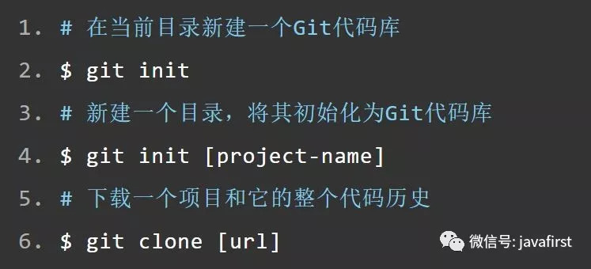

#####二、配置
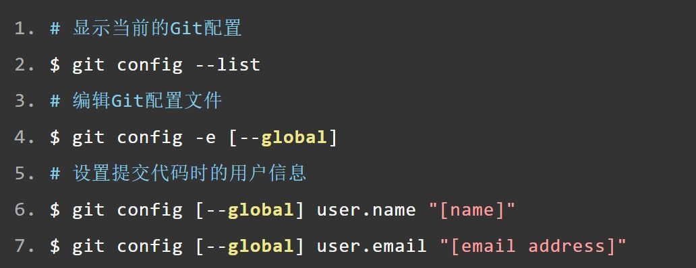

#####三、增加/删除/修改文件
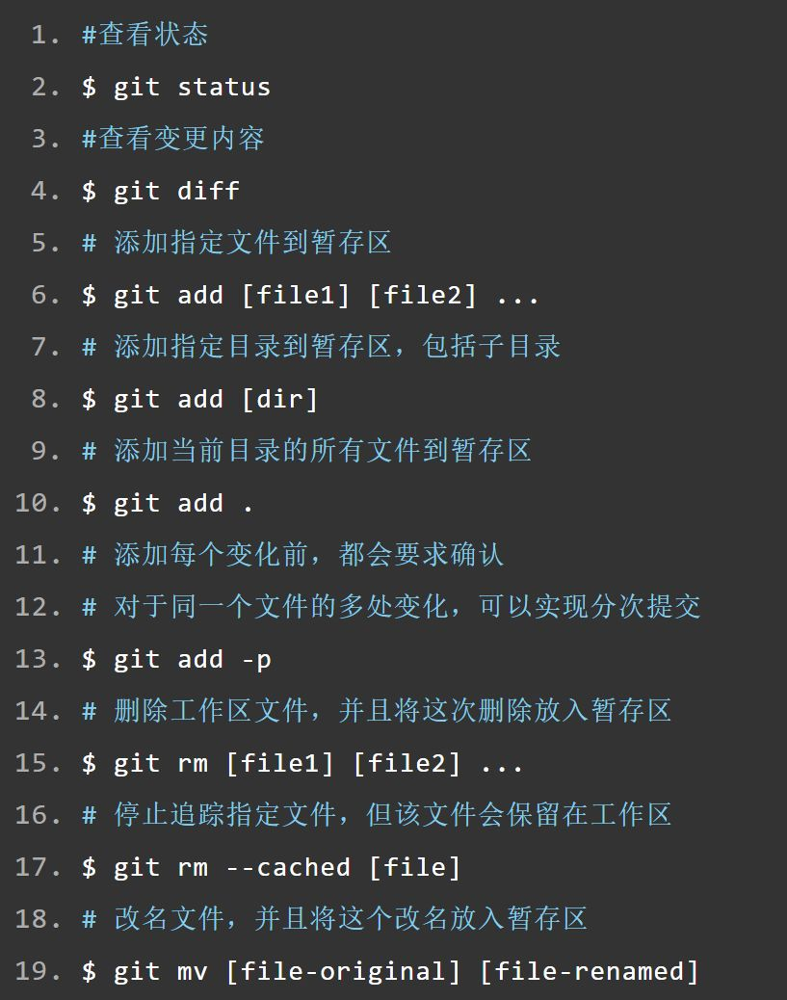

#####四、代码提交
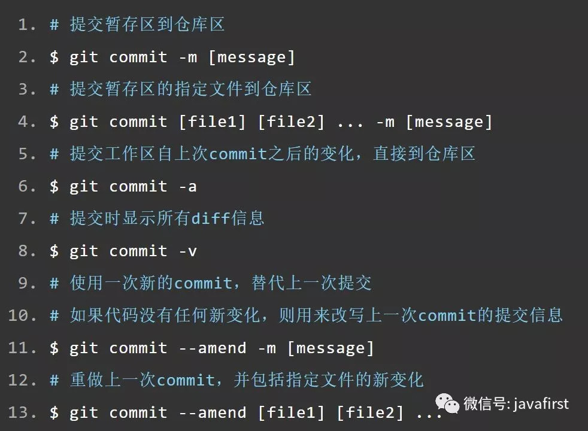

#####五、分支
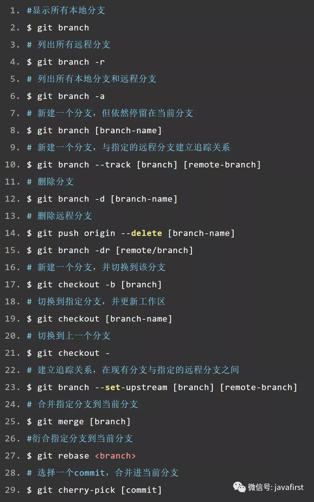

#####六、标签
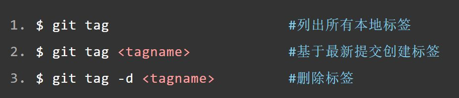
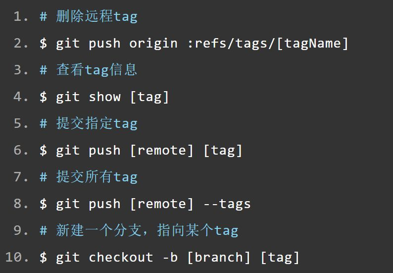

#####七、查看信息
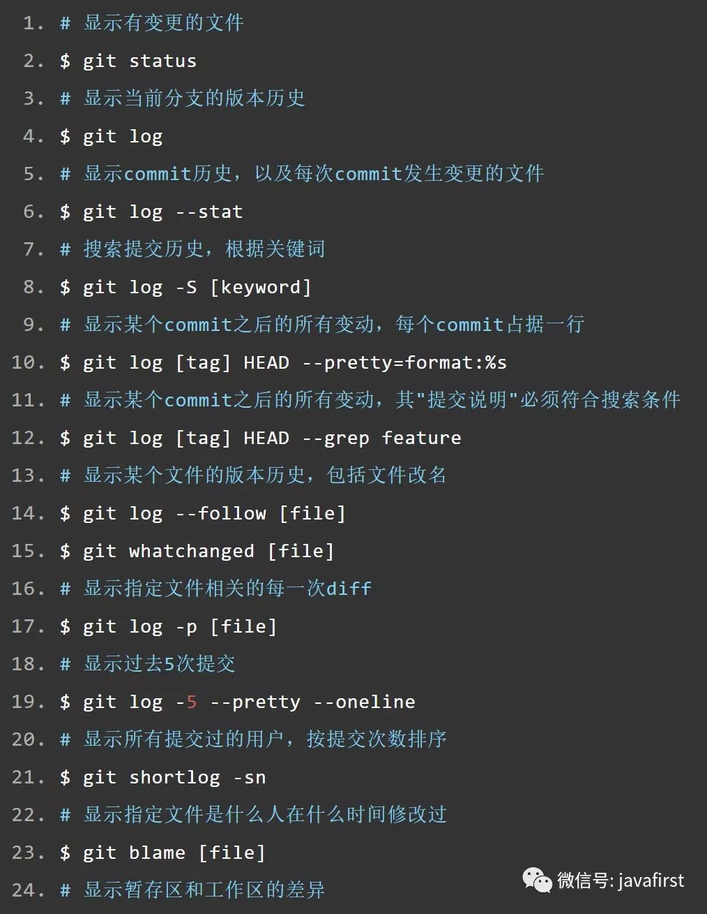
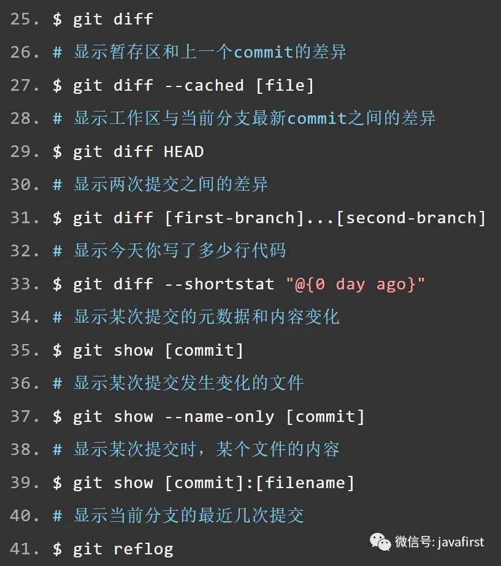

#####八、远程操作
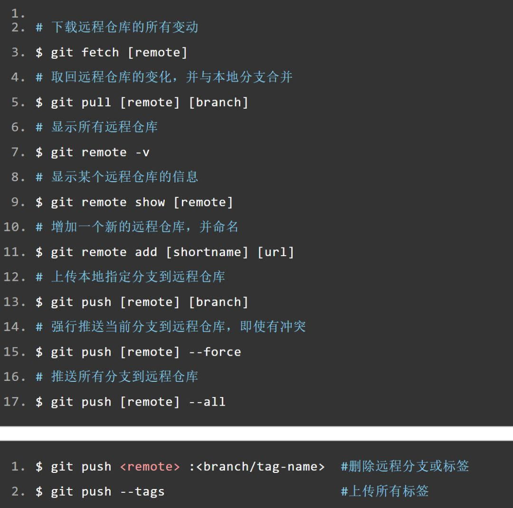

#####九、撤销
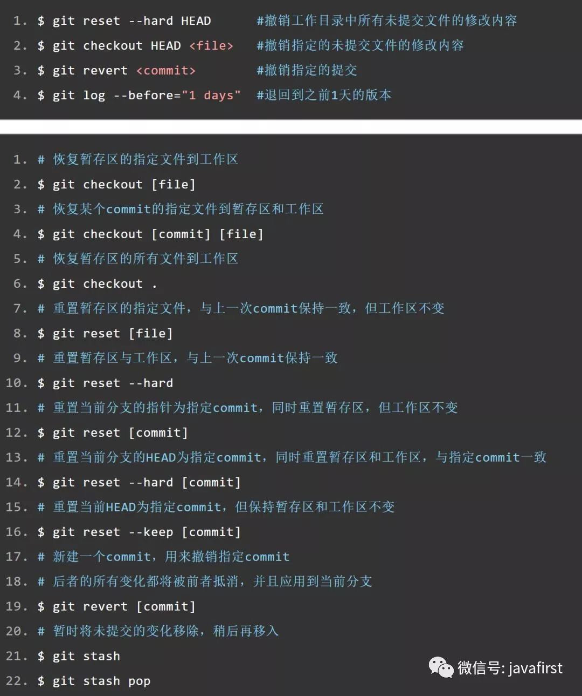

#####十、其他

生成一个可供发布的压缩包

